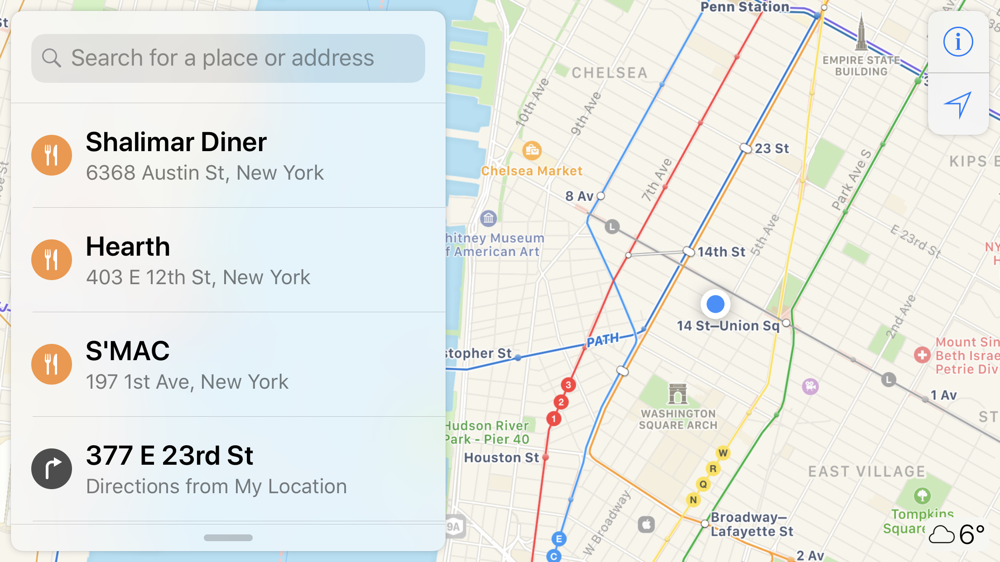
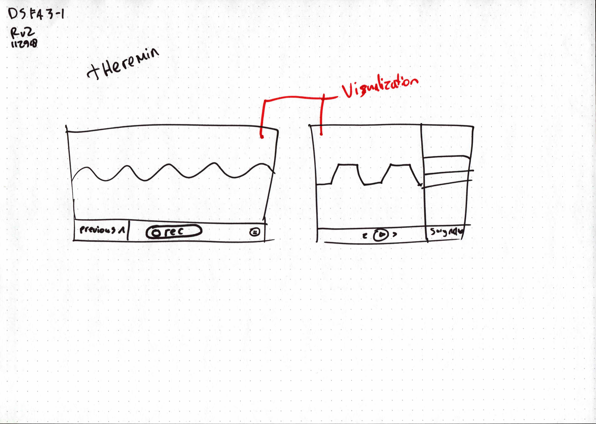

# Assignment 11

> You will design three interfaces for visualizations for your three data sources (AA, Dear Diary, and sensors).

> See [the assignment details](https://github.com/visualizedata/data-structures/blob/master/assignments/weekly_assignment_11.md)

## AA Map

The map for the AA meetings will be very similar in design to Apple Maps on the iPhone in landscape. I imagine the map to take up the full screen. In the top left corner, there will be a floating widget the user can use to search and filter for items.

  
Apple Maps on iPhone

  
First sketch

I was playing around with different ways filtering the data. I finally landed on a system where the user can use natural language in the search field. E.g. by searching for "Meetings between 5pm and 8pm". This might not be the most user friendly way, as it might not be the way the user expects filtering to work, but it provides a nice technical challenge.

  
Digital render

The search will search based on meetings specifically, not the bigger "meeting" (w/ title etc). This means that the user can search for specific types and times as well, instead of just location. Each meeting has a location associated with it through a relationship to the main meeting table.

The markers on the map will reflect the meeting type. I'm not too sure about the use of the colors here to be honest. I think it looks a little too confetti so I might dial it down a bit.

## Dear Diary

The dear diary final assignment will be the most "boring" of the three. I've been writing short responses / articles on different subjects tech. I'll be presenting them in a newswebsite kind of setting.

This final assignment is deliberately kept simple in order to save some time to make the other two super awesome.

By using a non-standard grid pattern I get to experiment with display grid a little bit more.

(Obviously not final visual interface design)

## Sensor

I'm building a [theremin](https://en.wikipedia.org/wiki/Theremin) using the accelerometer as input device. My interface will allow the user to record and save audio snippets to an account. The recordings will be stored on the filesystem. The users will be stored in a document based database, with the recordings stored nested within them.

The interface itself will consist of a big waveform that represents the sound the theremin is making. The background will have a color that changes based on the position of the input device.

