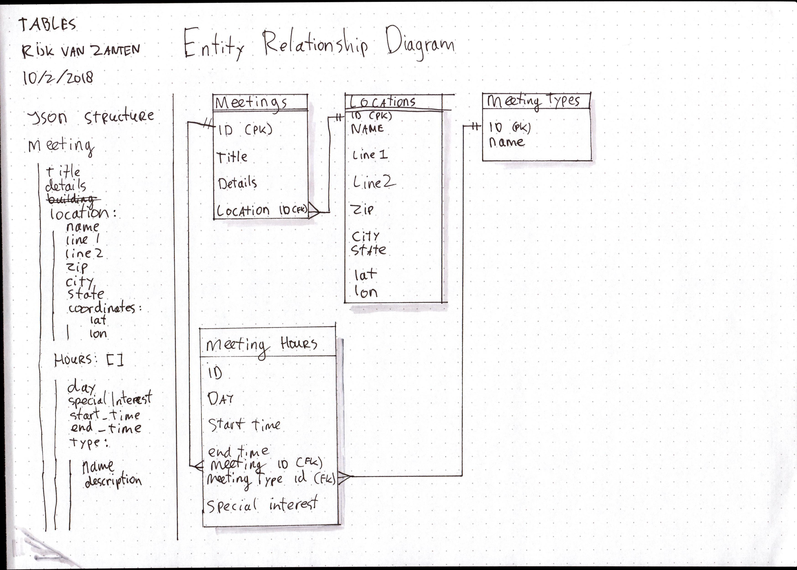
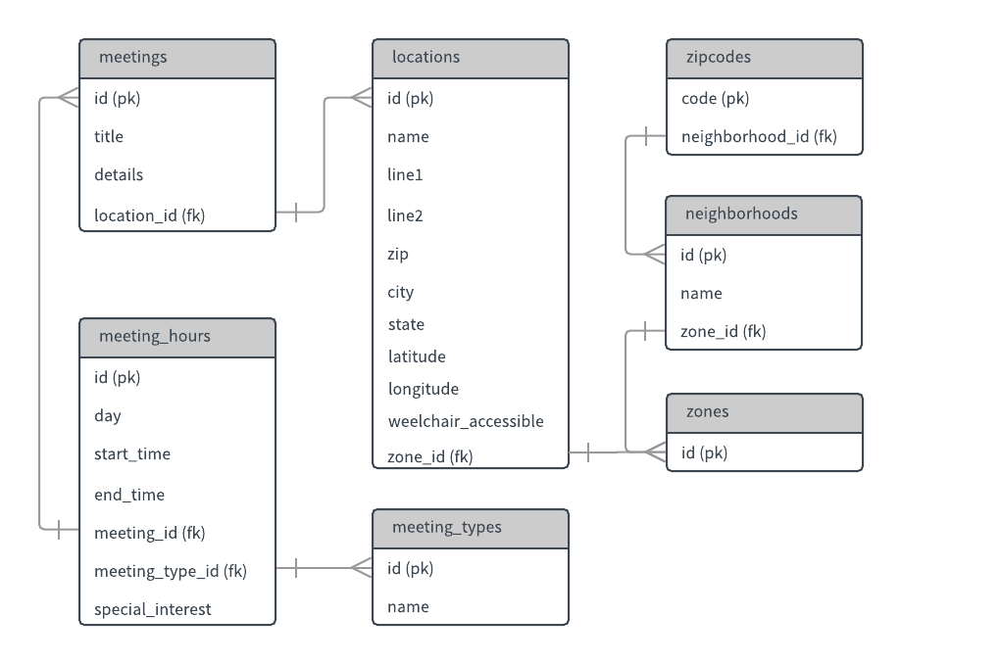

# Assignment 4

> See [the assignment details](https://github.com/visualizedata/data-structures/blob/master/assignments/weekly_assignment_04.md)

* [**Installer Script**](https://github.com/rijkvanzanten/data-structures/blob/master/assignment-4/install.js)
* [**Script**](https://github.com/rijkvanzanten/data-structures/blob/master/assignment-4/index.js)

## Installation & Usage

**Requirements**  
* Node 7.6 or higher

### 1. Clone this repo

```bash
$ git clone https://github.com/rijkvanzanten/data-structures.git
```

### 2. Go to the `assignment-4` folder

```bash
$ cd assignment-4
```

### 3. Install the NPM dependencies

```bash
$ npm install
```

### 4. Add a `.env` file

The following environment variables are used:

```
host=localhost
user=postgres
database=data-structures
password=root
port=5432
```

Change these values to your specific database credentials

### 5. Run `npm start`

`npm start` will first run the installer script, which clears the database and sets up the table structure. When that's done, it will run the inserter script, which will insert all the rows.

## Problem to solve

Create a database architecture for the AA data and insert the data you collected in the previous assignments into the database.

## The way I solved it

The AA data has a lot of different aspects to it. There are meetings with multiple hours. These meetings are at locations. There can be multiple meetings at the same location. Each location is in a zone, each zone has multiple neighborhoods, each neighborhood covers multiple zipcodes, etc, etc, etc.

My initial database structure looked like this:



As you can see, I decided to extract the meeting types (fe OD Open Discussion / C Closed Meeting) into a separate table. This is because I figured there might be a need to add more data to the meeting types, like a description text or an image later.

The same logic applied when I started including the zones into the database architecture:



In this final setup, the zones, neighborhoods, and zipcodes are added in separate tables. I've chosen to normalize every piece of data in order to make everything efficiently searchable, something that was already possible on the original website (search by zipcode / zone / type / address etc). The `zones` table only contains it's identifier (eg `01`, `07`, `10`) as there is no other information on particular zones. I can imagine that other columns will be added to the `zones` table in the future in order to render them on a map, for example by using a column that holds the coordinates of the border of the zone.

By extracting all the data instead of just the locations in the previous assignments, I made a real challenge for myself. Not only did I have to figure out the SQL statements (in Postgres flavor), but I also had to really play around with the order of execution. Zipcodes could only be inserted when the neighborhoods where already there (because the zipcode holds the ID of the neighborhood). Likewise;

* neighborhoods could only be inserted when all the zones where done;
* locations could only be inserted when the zones where done;
* meetings could only be inserted when the locations where done;
* meeting_hours could only be inserted when meeting_types was done.

Another small but significant problem was the fact that I didn't extract any separate zone or meeting type information before. I had to create [a separate data file](./zones.json) for the zones, neighborhoods, and zipcodes. I had to create this manually from scratch because the zones and neighborhoods where only available in this schema:


## Notes

By using backticks in JS, I was able to make SQL queries on multiple lines, which greatly improved readability of the file:

```js
[
  // Single line
  "DROP TABLE IF EXISTS meeting_hours CASCADE",

  // Multiple lines
  `CREATE TABLE meeting_hours (
    id SERIAL PRIMARY KEY,
    day CHAR(3) NOT NULL,
    start_time TIME NOT NULL,
    end_time TIME NOT NULL,
    special_interest VARCHAR(255) NULL,
    meeting_id INTEGER NOT NULL REFERENCES meetings(id),
    meeting_type_id VARCHAR(2) NOT NULL REFERENCES meeting_types(id)
  )`
]
```
